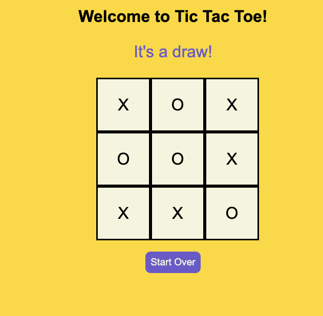

# Kids Tic Tac Toe

Kids Tic Tac Toe is a simple, interactive, and fun implementation of the classic Tic Tac Toe game. The game is designed to be appealing to kids, with bright colors, large text, and an intuitive user interface.

## How to Play

1. The game starts with Player 'X'. Click on any empty cell to place an 'X' there.
2. Next, it's Player 'O's turn. Click on an empty cell to place an 'O'.
3. Players take turns placing their symbol on the board until one player has three in a row horizontally, vertically, or diagonally, or all cells are filled resulting in a draw.
4. The game announces whose turn it is at the top of the game board. 
5. When a player has won, or the game is a draw, a message will be displayed at the top announcing the result.
6. Click the "Start Over" button to reset the game and start a new one.

## Installation

1. Clone this repository or download the files directly.
2. Open `index.html` in any web browser to start playing the game.

## Files

- `index.html`: This file contains the HTML structure of the game board and user interface.
- `style.css`: This file contains the CSS styles that give the game its kid-friendly look and feel.
- `script.js`: This file contains the JavaScript that controls the game logic and interactivity.

We hope you and your kids enjoy playing Kids Tic Tac Toe!

## Gist as embedded html
This game is also available in one embedded html file- https://gist.github.com/chandradeoarya/59f89b08e7f73da7c6e211b87fa93e90